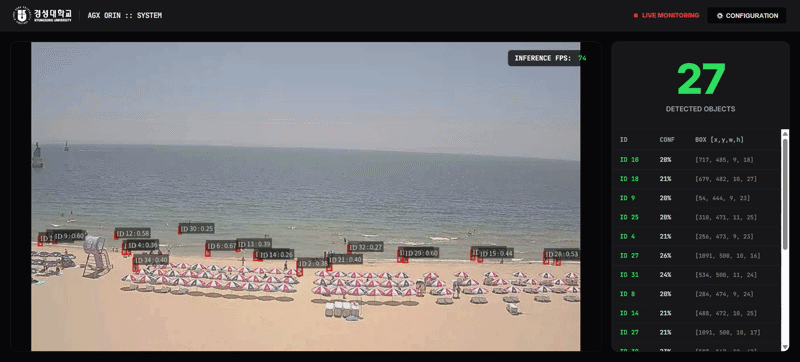
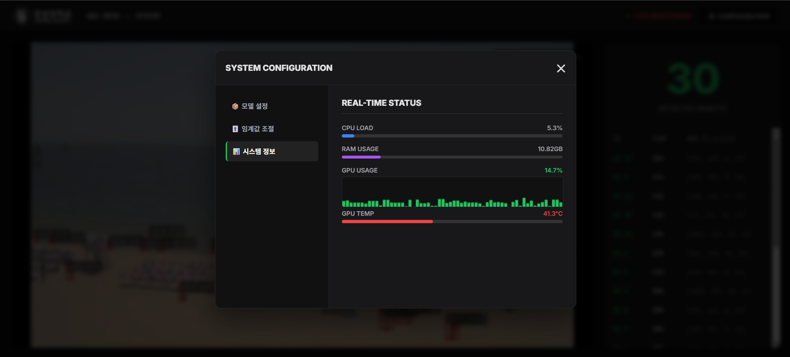

# 🛡️ Real-time AI Surveillance System (Edge)

이 폴더는 Jetson AGX Orin 기반의 실시간 지능형 관제 시스템 핵심 코드를 포함하고 있습니다.

### 🔴 Live Monitoring Preview

> **System Overview**
> - **Inference Engine**: YOLOv8 + NVIDIA DeepStream
> - **Performance**: 60+ FPS Real-time Processing
> - **Features**: Object Detection, Real-time Web Dashboard, Hardware Telemetry

---
### ⚙️ Web Dashboard & Configuration
사용자 친화적인 웹 UI를 통해 실시간으로 시스템을 모니터링하고 추론 설정을 제어할 수 있습니다.

#### 📊 1. Hardware Telemetry (실시간 시스템 상태)

- CPU, RAM, GPU 사용량 및 온도 실시간 추적

#### 🧠 2. Dynamic Model Switching (동적 모델 교체)

- 시스템 재시작 없이 YOLOv8 텐서알티(.engine) 모델 파일 즉각 교체 가능

#### 🎛️ 3. Threshold Control (추론 임계값 조절)

- Confidence 및 IoU(NMS) 값을 웹 대시보드에서 실시간으로 조절 반영
