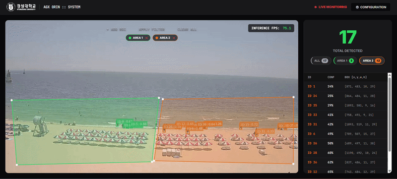

# 🛡️ Edge-AI Intelligent Surveillance System v2.0
> **Multi-ROI Filtering & Dynamic User Interface Implementation**

본 프로젝트는 NVIDIA Jetson AGX Orin 환경에서 DeepStream SDK를 활용해 구축된 차세대 지능형 관제 시스템입니다. v2.0에서는 복합 영역 탐지 및 사용자 중심의 실시간 데이터 시각화 인터페이스를 구현하는 데 집중하였습니다.

---

## 📺 System Preview

---

## 🚀 Key Evolutionary Features

### 1. Advanced Multi-ROI Solution
* **Custom Area Definition**: 단일 영역을 넘어 사용자가 정의한 복수의 다각형 영역(Multi-Polygon)을 실시간으로 추적합니다.
* **Spatial Logic Filtering**: 객체의 하단 중앙부 점(Bottom-Center)을 기준으로 영역 진입 여부를 정확히 판단하는 수학적 필터링 알고리즘이 적용되었습니다.

### 2. Context-Aware Visualizing (가시성 극대화)
* **Dynamic Bounding Box**: 객체가 진입한 영역의 고유 컬러와 객체의 바운딩 박스를 실시간으로 동기화하여 관제 직관성을 높였습니다.
* **ROI-Specific Metadata**: 딥스트림 메타데이터 내에 ROI 인덱스를 삽입하여 구역별 객체 데이터를 개별적으로 추출합니다.

### 3. Smart Intelligence Dashboard
* **Interactive Area Tabs**: 'ALL', 'AREA 1', 'AREA 2' 등 구역별 탭 UI를 통해 특정 구역의 탐지 현황만 독립적으로 필터링하여 모니터링할 수 있습니다.
* **Real-time Statistics**: 전체 객체 수와 구역별 세부 카운트를 실시간 대시보드 형태로 제공합니다.

---

## 🛠️ Technical Stack
* **Hardware**: NVIDIA Jetson AGX Orin
* **Inference Engine**: DeepStream SDK (TensorRT Engine)
* **Supported Models**: YOLOv8 Nano(n), Small(s), Medium(m), Large(l) - 총 4종의 최적화된 엔진 지원
* **On-the-fly Switching**: 웹 UI의 Configuration 메뉴를 통해 실행 중에도 실시간으로 모델 엔진을 교체하고 임계값을 조절할 수 있습니다.
* **Frontend**: Vanilla JS, HTML5 Canvas HUD, CSS3 Dark Theme

---
*Developed by: An Soyoung*
